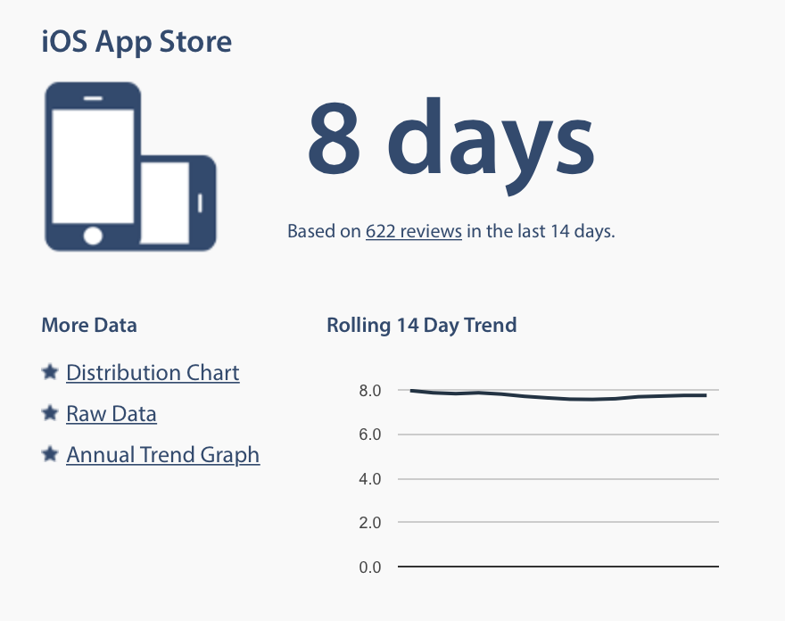
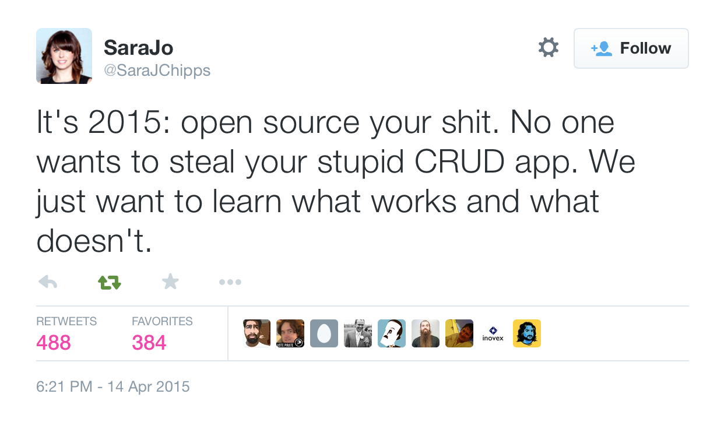
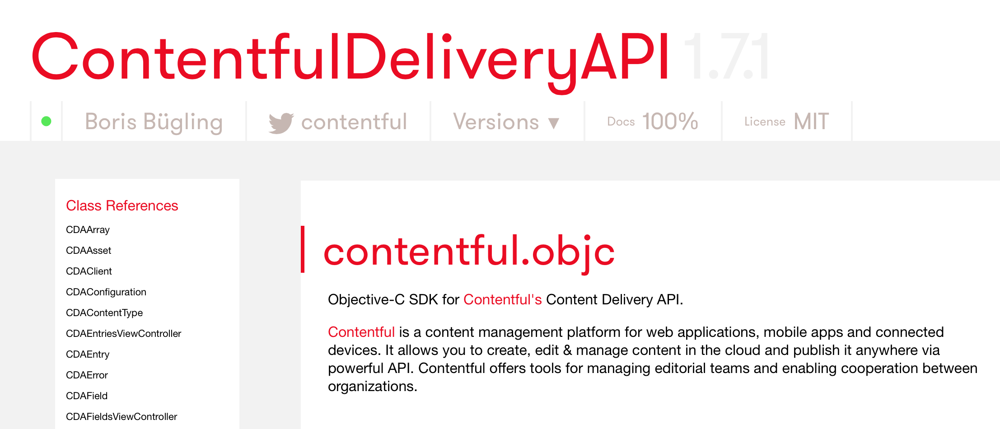
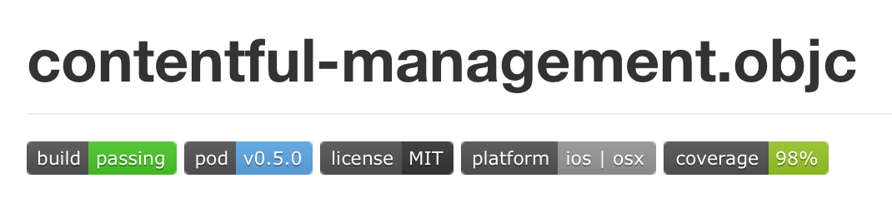
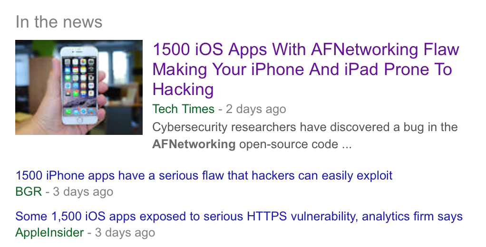

# Better API Clients

## APIDays Berlin, April 2015

### Boris Bügling - @NeoNacho


---

## CocoaPods


---

## Contentful


^ A single tool to reach any screen.
API-first content management system for multi-device online publishing

---


---


---


---



source: <http://appreviewtimes.com>

---

> Mobile apps need to be more reliable than the web.

---


---

> Let's build better API clients to help building better apps

---

## Open Source

---



---

## Documentation

---

```objc
/** The server address to use for accessing any resources.
Default value: "cdn.contentful.com" */
@property (nonatomic) NSString* server;

/** Configure a custom user-agent to be used in the
HTTP request headers */
@property (nonatomic) NSString* userAgent;
```

---



---

# cocoapods-docstats

```bash
$ pod lib docstats
398 tokens, 100.0% documented
```

---

## Testing

---

```swift
let expectation = expectationWithDescription("...")

waitForExpectationsWithTimeout(10) { (error) in
    // ...
}

expectation.fulfill()
```

---

# API Blueprint

```markdown
# GET /message
+ Response 200 (text/plain)

        Hello World!
```

---

# CCLRequestReplay

```objc
NSURL *blueprintURL = [[NSBundle mainBundle]
URLForResource:@"fitnessfirst" withExtension:@"apib"];
CCLRequestReplayManager *replayManager = [CCLRequestReplayManager 
managerFromBlueprintURL:blueprintURL error:nil];
[replayManager replay];
```

---



---

# cocoapods-coverage

```bash
pod lib coverage
```

---

## Distribution

---

"Download the SDK from our webpage."

---


---

```ruby
pod 'ContentfulDeliveryAPI'
```

---

# cocoapods-packager

```bash
pod package ContentfulDeliveryAPI.podspec
```

---



---

```ruby
spec.dependency 'AFNetworking', '>= 2.5.2'
```

---

# So, we're done, right?


---

### Anticipating change is one of the central themes of REST.


---

Example: creating a poll

---

```html
<html>
    <body>
        <h1>Poll</h1>
        <ul>
            <li><a href="/questions/new" rel="create">Make a new question</a></li>
        </ul>     
    </body>
</html>
```

---

- Offers us to create a question
- We can fill in the form we get
- Submit the form

---

We can do the same in our apps with Hypermedia

---

# Formats

- HAL (application/hal+json)
- Siren (application/vnd.siren+json)

---

# Siren Link

```json
{
    "entities": [
        {
            "links": [
                { "rel": ["self"], 
                  "href": "questions/1/choices/1" }
            ],
            "rel": ["choices"],

            "properties": { "choice": "Swift", "votes": 22 }
        }
    ]
}
```

---

# Siren Action

```json
{
    "actions": {
        "create": {
            "href": "/questions",
            "method": "POST",
            "fields": [
                { "name": "question" },
                { "name": "choices" }
            ],
            "type": "application/x-www-form-urlencoded"
        }
    }
}
```

---

## We can now change implementation details on the fly

---

# Change URIs of resources

e.g. `/polls/{id}` to `/questions/{id}`

---

# Change HTTP methods

e.g. `PUT` to `POST`

---

# Change the content-type

---

# Change fields used in forms

---

# Representor


---

# Presence of a transiton

```swift
if let transition = representor.transitions["create"] {
    
} else {
    // ...
}
```

---

# Attributes of a transition

```swift
if let transition = representor.transitions["create"] {
    transition.method
    transition.uri
    transition.suggestedContentType
}
```

---

# Performing a transition

```swift
request(transition, attributes: [
    "question": "Favourite programming language?",
    "choices": [ "Swift", "Ruby", "COBOL" ]
])
```

---


---

# What have we learned?

- Publish source code!
- Document!
- Test!
- Be robust against change!

---

# Thank you!


---

@NeoNacho

boris@contentful.com

https://github.com/neonichu

https://speakerdeck.com/neonichu/build-better-api-clients

http://www.contentful.com
