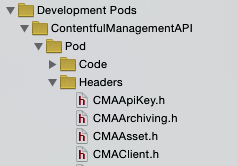

# CocoaPods 0.36

## CocoaHeads Berlin, March 2015

### Boris Bügling - @NeoNacho


---


---

# Swift 🎉


---

# Dynamic frameworks

**Opt-in using**

```ruby
use_frameworks!
```

**in your Podfile**


---

# iOS 8 only :(


---

# Here's why:

- Swift is supported on OS X 10.9 / iOS 7 and newer, as stated by Apple numerous times.
- There is [no support for building static archives with Swift](http://openradar.appspot.com/radar?id=5536341827780608).
- Dynamic frameworks are supported on all versions of OS X.
- Dynamic frameworks are unsupported on iOS versions prior to 8:

    > ld: warning: embedded dylibs/frameworks only run on iOS 8 or later.

---

# Frameworks

- Dynamic Library
- Public Headers
- Code Signature
- Resources
- Module Map
- Info.plist
- (Hosted Frameworks/Libraries)


---

# Resources

- Load from framework bundle instead of main bundle

```swift
NSBundle(forClass: Yolo.self)
```

- Will also work if integrated via static libraries

---

# Module names

```swift
//let c99ext_identifier: String -> String?
func module_name(spec: Specification) -> String {
  return spec.module_name
    ?? c99ext_identifier(spec.header_dir)
    ?? c99ext_identifier(spec.name)!
}
```

---

# Module Maps

```
framework module BananaKit {
  umbrella header "BananaKit.h"

  export *
  module * { export * }
}
```

---

# Umbrella header

```objc
#import <Foundation/Foundation.h>

@import Monkey;

#import "BKBananaFruit.h"
#import "BKBananaPalmTree.h"
#import "BKBananaPalmTreeLeaf.h"

FOUNDATION_EXPORT double BananaKitVersionNumber;
FOUNDATION_EXPORT const unsigned char BananaKitVersionString[];
```

---

# Our favourite

```
<unknown>:0: error: could not build Objective-C module 'BananaKit'
```


---


---

# ASCII plist support in Xcodeproj

- No more huge diffs
- Emoji work 👍
- Uses `DevToolsCore.framework` via fiddle:

```ruby
require 'fiddle'

image = Fiddle.dlopen(PATH)
function = Fiddle::Function.new(image[symbol],
	parameter_types, return_type)
result = function.call(a, b, c)
```

---

# Plugin DSL in Podfile

```
plugin 'cocoapods-keys', {
  :project => 'ManagementSDK',
  :keys => [ 'ManagementAPIAccessToken' ]
}
```

---

# Other changes

- Configure sources for private repos!
- Link vendored frameworks directly
- `xcodebuild` warnings => lint warnings
- Reflect Development Pods directories in Xcode



---

# CocoaPods.org

- expandable search results
- better ordering
- landing page for each Pod:
<http://cocoapods.org/pods/MiniFuture>

---

# Inline preview for social media


---

# Metrics


---

```json
// http://metrics.cocoapods.org/api/v1/pods/MiniFuture

{
	"cocoadocs": {
	    "created_at": "2015-03-08 16:48:25 UTC",
	    "doc_percent": 22,
	    "dominant_language": "Swift",
	    "download_size": 416,
	    "initial_commit_date": "2015-03-01 12:03:09 UTC",
	    "license_canonical_url": "http://opensource.org/licenses/MIT",
	    "license_short_name": "MIT",
	    "notability": 0,
	    "quality_estimate": 50,
	    "readme_complexity": 72,
	    "rendered_readme_url": "http://cocoadocs.org/docsets/MiniFuture/0.1.0/README.html",
	    "total_comments": 8,
	    "total_files": 4,
	    "total_lines_of_code": 327,
	    "total_test_expectations": 204,
	    "updated_at": "2015-03-08 16:48:25 UTC"
	},
	"github": {
	    "contributors": 1,
	    "created_at": "2015-03-01 10:09:08 UTC",
	    "forks": 0,
	    "language": "Swift",
	    "open_issues": 0,
	    "open_pull_requests": 0,
	    "stargazers": 8,
	    "subscribers": 2,
	    "updated_at": "2015-03-05 01:01:44 UTC"
	}
}
```

---

# Quality


---

```json
// https://cocoadocs-api-cocoapods-org.herokuapp.com/pods/MiniFuture/stats

[
	{
	    "applies_for_pod": false,
	    "description": "Testing a library shows that the developers care
	    about long term quality on a project as internalized logic is made explicit via testing.",
	    "modifier": -20,
	    "title": "Test Expectations / Line of Code"
	},
	{
	    "applies_for_pod": false,
	    "description": "Too big of a library can impact startup time, and add redundant assets.",
	    "modifier": -10,
	    "title": "Download size"
	},
	{
	    "applies_for_pod": false,
	    "description": "Smaller, more composeable classes tend to be easier to understand.",
	    "modifier": -8,
	    "title": "Lines of Code / File"
	},
	[...]
	{
	    "applies_for_pod": true,
	    "description": "A popular library means there can be a community to help improve and maintain a project.",
	    "modifier": 5,
	    "title": "Is popular"
	}
]
```

---

### Checking your Pod quickly

```bash
# get it from: https://github.com/neonichu/pod-utils
$ ./quality.rb MiniFuture
[...]
🚫 Badly Documented: Small amounts of documentation generally means the project
is unmature.
🚫 Great README: A well written README gives a lot of context for the library,
providing enough information to get started.
🚫 Is popular: A popular library means there can be a community to help improve
and maintain a project.

Current quality estimate: 47
```

---

# Test Jam

Date: April 18th + 19th 2015
Locations: NYC / SF / + More


---

# What happens?

* Add tests to the library.
* Add Travis CI].
* Add Coveralls Support.
* Submit a Pull Request to the original repo.

---

# Berlin?


---

# Thanks!


