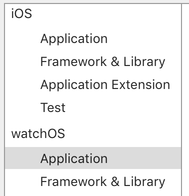
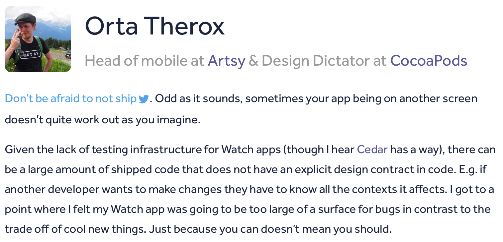
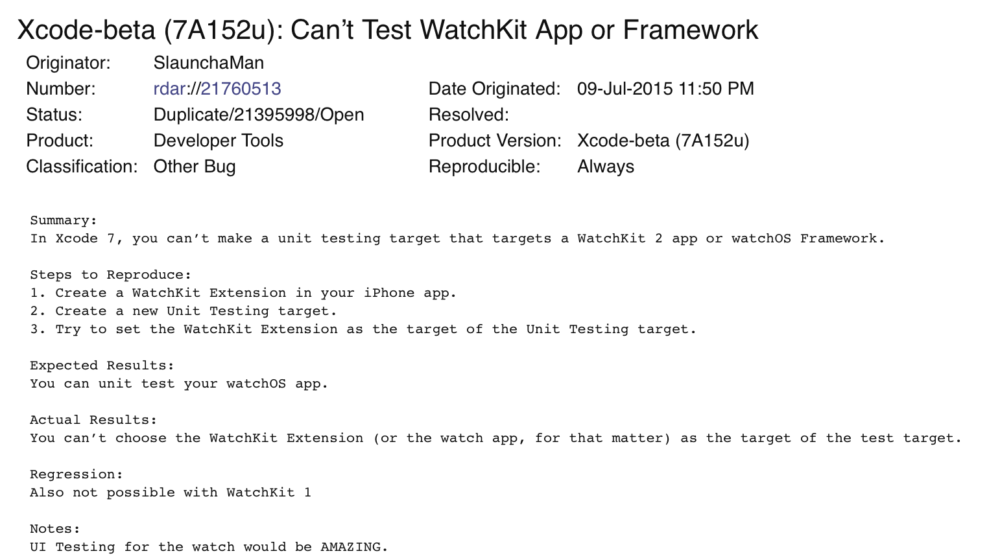

# Testing ⌚️ Apps and Other Extensions

### Boris Bügling - @NeoNacho


<!-- use Poster theme, black -->

---

## CocoaPods

<!--  -->


---

## Contentful


---


---

# ⌚️ apps

---

# No test targets 😢



---



---

# No changes in watchOS 3

---

# Possibilities

---

### YOLO, just don't write bugs


---


---

## Use `PivotalCoreKit`

---

- Pivotal's collection of helpers for iOS
- Includes a bunch of testing infrastructure
- Works together with their BDD framework `Cedar`:

```objc
describe(@"Example specs on NSString", ^{
    it(@"lowercaseString returns a new string with everything in lower case", ^{
        [@"FOOBar" lowercaseString] should equal(@"foobar");
    });
});
```

---

### Testing setup

```objc
#import "Cedar.h"
#import "MyInterfaceController.h"
#import "PCKInterfaceControllerLoader.h"

using namespace Cedar::Matchers;
using namespace Cedar::Doubles;

SPEC_BEGIN(MyInterfaceControllerSpec)

describe(@"MyInterfaceController", ^{
__block PCKInterfaceControllerLoader *loader;
__block MyInterfaceController *subject;

    beforeEach(^{
        NSBundle *testBundle = [NSBundle bundleForClass:[self class]];
        loader = [[PCKInterfaceControllerLoader alloc] init];
        subject = [loader 
          interfaceControllerWithStoryboardName:@"Interface"
          identifier:@"myId" bundle:testBundle];
    });

    // ...
});

SPEC_END
```

---

### Implementation

```objc
@implementation MyInterfaceController
- (void)willActivate
{
    [super willActivate];
    [self.label setText:@"Yay WatchKit!"];
}
@end
```

---

### Test

```objc
it(@"should show the correct text", ^{
  [subject willActivate];
  subject.label should have_received(@selector(setText:)).with(@"Yay WatchKit!");
});
```

---

- Test doubles for **all** of WatchKit
- Huge 3rd party dependency for your testsuite
- Has to catch up with new versions of watchOS
- Tests run on macOS only
- Doesn't work very well with Swift

---

# Move code into a framework

---

- Model => Framework
- Presentation Logic => Framework
- View => Watch Extension

---

# MVVM


---

## View Model contains the presentation logic

---

# Model

```swift
struct Person {
  let salutation: String
  let firstName: String
  let lastName: String
  let birthdate: Date
}
```

---

# WKInterfaceController

```swift
override func awakeWithContext(context: AnyObject!) {
  if let model = context as? Person {
    if model.salutation.characters.count > 0 {
      nameLabel.setText("\(model.salutation) \(model.firstName) \(model.lastName)")
    } else {
      nameLabel.setText("\(model.firstName) \(model.lastName)")
    }

    let dateFormatter = DateFormatter()
    dateFormatter.dateFormat = "EEEE MMMM d, yyyy"
    birthdateLabel.setText(dateFormatter.string(from: model.birthdate))
  }
}
```

---

# ViewModel

```swift
struct PersonViewModel {
  let nameText: String
  let birthdateText: String
}
```

---

# ViewModel update logic

```swift
if let model = model as? Person {
  if model.salutation.characters.count > 0 {
    nameText = "\(model.salutation) \(model.firstName) \(model.lastName)"
  } else {
    nameText = "\(model.firstName) \(model.lastName)"
  }

  let dateFormatter = DateFormatter()
  dateFormatter.dateFormat = "EEEE MMMM d, yyyy"
  birthdateText = dateFormatter.string(from: model.birthdate)
}
```

---

# Updated WKInterfaceController

```swift
override func awakeWithContext(context: AnyObject!) {
  if let viewModel = context as? PersonViewModel {
    nameLabel.setText(viewModel.nameText)
    birthdateLabel.setText(viewModel.birthdateText)
  }
}
```

---

# What did we gain?

- Our presentation logic does not depend on WatchKit anymore
- It can be moved to a cross-platform framework
- It can then be tested on macOS or iOS

---

# UI tests?

- Not supported on watchOS, either
- There is almost no view code on watchOS <= 2
- WatchKit is essentially a ViewModel itself

---

# watchOS 3

- Custom UI with SpriteKit / SceneKit
- Gesture recognizers and crown interactions
- Tailored background tasks and local notifications

---

# [rdar://21760513](https://openradar.appspot.com/21760513)



---

# Application extensions

---

### Similar to watch apps, no test bundles specific to extensions

---

- Extension can be launched from main app in UI tests
- Since it is a remote view controller, only coordinates work:

```objc
XCUICoordinate* coordinateOfRowThatLaunchesYourExtension = 
[app coordinateWithNormalizedOffset:CGVectorMake(0.5, 603.0 / 736.0)];
[coordinateOfRowThatLaunchesYourExtension tap];
```

---

Some of them are more like integrations, though:

- Today extensions
- iMessage extensions
- Sticker packs
- Intents (SiriKit)
- ...

---

# Solution

- Also move code into frameworks
- Use MVVM to make code testable outside of the extension context

---

## Sharing a framework between extensions and apps

- Set `APPLICATION_EXTENSION_API_ONLY` for compile time safety
- Use `NS_EXTENSION_UNAVAILABLE_IOS` for disallowing symbols

---

## Sharing a framework between extensions and apps

- Use custom macros for conditional compilation
- CocoaPods subspecs can help here

---

## Example: GTMSessionFetcher

Disables `GTM_BACKGROUND_TASK_FETCHING` in application extension subspec:

```ruby
s.subspec 'AppExtension' do |ap|
  ap.source_files = …
  ap.pod_target_xcconfig = { 
    'GCC_PREPROCESSOR_DEFINITIONS' => 
      '$(inherited) GTM_BACKGROUND_TASK_FETCHING=0' }
end
```

---

## Podfile

```ruby
target 'App' do
  pod 'GTMSessionFetcher'
end

target 'Extension' do
  pod 'GTMSessionFetcher/AppExtension'
end
```

---

# Conclusion

- Move almost all code to frameworks
- Those can be tested like any other part of your codebase
- Use MVVM to have as little logic as possible in the actual extension environment

---

# Thank you!


---

-

-

-

@NeoNacho

boris@contentful.com

http://buegling.com/talks


